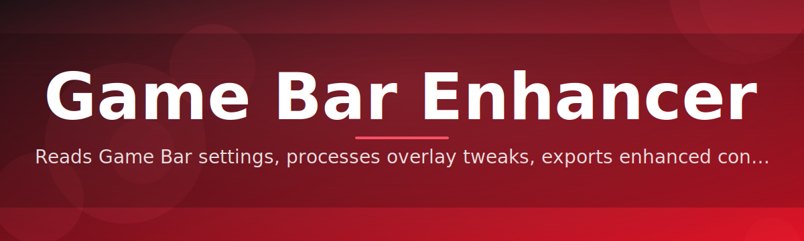
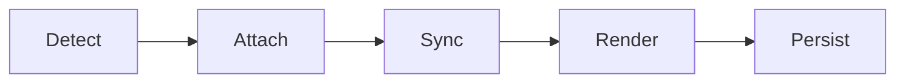

# game-bar-enhancer 🎮⚡

  

*The overlay layer Windows should have shipped — faster, quieter, and finally under your control.*

  

---

## 🧭 Overview

**game-bar-enhancer** is a lightweight companion utility that sits on top of the native Windows Game Bar and turns it into a genuinely useful command center. Instead of fighting a stock overlay that eats frames, hides settings three menus deep, and forgets your preferences every reboot, you get a refined layer with predictable behavior, instant recall of your setup, and a UI that respects your screen real estate.

This project exists because the built-in overlay experience was designed for the average case, not the serious one. Streamers need clean capture toggles. Competitive players need zero-latency HUD access. Everyone else just wants FPS counters, mic status, and recording controls without hunting through Settings. Game Bar Enhancer closes that gap without replacing Windows components or touching your drivers.

It's built for PC gamers, streamers, and anyone who spends real hours in fullscreen apps and wants their overlay tooling to feel like part of the game, not an interruption from Redmond. No accounts, no background telemetry servers, no bundled junk — just a focused Windows utility that does one job precisely.

## 🚀 Get It

  

> [!TIP]
> Pin the landing page. Every stable build, checksum, and changelog entry lives there first — this README tracks the same version but the page is the source of truth.

---

## 🧩 What It Actually Does

- **Instant overlay recall** — reopen the exact panel layout you had last session; no re-toggling five switches every launch.

- **Frame-safe HUD rendering** — the performance overlay draws with minimal compositor overhead, so watching your FPS doesn't cost you FPS.

- **One-key capture control** — start, pause, and clip recordings without leaving the game window or triggering focus loss.

- **Per-game profiles** — mic gain, overlay opacity, and hotkey sets switch automatically based on the foreground process.

- **Silent background mode** — the enhancer idles at near-zero CPU when no supported game is running; it doesn't loiter.

- **Widget-level customization** — resize, dock, or hide individual widgets (clock, network, battery, thermals) independently.

- **Multi-monitor awareness** — overlay anchors to the display actually running the game, not whichever screen has focus.

- **Crash-safe settings persistence** — configuration writes are atomic; a hard reset won't wipe your profile back to defaults.

## 🏁 Getting Started

1. Open the landing page via the download button above.

2. Grab the current build — a single standalone executable, no installer wizard.

3. Run it once; Game Bar Enhancer detects your existing Game Bar setup and layers on top automatically.

4. Press `Win + G` as usual — the enhanced panel replaces the stock one immediately.

> [!NOTE]
> First launch takes a few seconds longer while it indexes installed games for profile matching. Subsequent launches are instant.

## 🖥️ System Requirements

| Component | Minimum |
|---|---|
| OS | Windows 10 (21H2+) or Windows 11 |
| Architecture | x64 |
| Dependencies | None — fully standalone |
| Disk | Under 40 MB |
| Permissions | Standard user (admin not required) |

  

## ⚙️ How It Works

The enhancer operates as a thin process that hooks into the existing Game Bar surface rather than replacing the OS component outright. That's why it stays stable across Windows updates — it augments, it doesn't fork.

1. **Detect** — identifies the active Game Bar session and foreground game process.

2. **Attach** — layers the enhanced UI on top of the native overlay surface.

3. **Sync** — loads the matching per-game profile (hotkeys, widgets, capture settings).

4. **Render** — draws widgets through a low-overhead path tuned to avoid frame drops.

5. **Persist** — writes any changes back to your profile the moment you close the panel.

> [!IMPORTANT]
> Game Bar Enhancer never modifies game files, drivers, or anti-cheat-monitored memory. It operates entirely at the overlay/UI layer.

## 🔧 Troubleshooting

<strong>The overlay doesn't appear when I press Win + G</strong>

Confirm the native Windows Game Bar is enabled under Settings → Gaming → Game Bar. The enhancer attaches to that surface — if it's disabled at the OS level, there's nothing to enhance.

<strong>FPS counter shows 0 or freezes</strong>

Some exclusive-fullscreen games block overlay hooks by design. Switch the game to borderless or windowed-fullscreen mode for full widget support.

<strong>My per-game profile didn't load</strong>

Profiles match by executable name. If the game updated and renamed its binary, recreate the profile once — it'll persist correctly afterward.

<strong>Recording clips aren't saving</strong>

Check the capture output path in Settings → Capture. If the target drive was removed or renamed, the enhancer falls back silently rather than erroring — point it back to a valid folder.

<strong>Does this affect anti-cheat systems?</strong>

No. It reads overlay/UI state only and never touches game memory. Still, always check a specific title's third-party overlay policy if you're competing in ranked ladders.

## 🎨 UI / UX Details

> [!TIP]
> Everything below is remappable in **Settings → Controls**.

| Action | Default Shortcut |
|---|---|
| Open overlay | `Win + G` |
| Toggle FPS widget | `Ctrl + Shift + F` |
| Start/stop recording | `Win + Alt + R` |
| Mute mic | `Win + Alt + M` |
| Quick screenshot | `Win + Alt + PrtScn` |
| Cycle profiles | `Ctrl + Shift + P` |

- **Themes:** Dark (default), Light, High-Contrast, and Ambient (adapts to game palette).

- **Widget docking:** drag any widget to snap it to nine anchor zones.

- **Opacity slider:** per-widget, 10%–100%, saved live.

- **Compact mode:** collapses the panel to a single-row strip for minimal HUD intrusion.

## 🤝 Contributing & Community

We take stability seriously — every merged change targets zero regression in frame overhead. If you'd like to contribute:

- Open an issue with a clear repro before submitting UI changes.

- Keep pull requests scoped; large multi-feature PRs slow review and rollback.

- Discussion threads are the right place for feature requests — issues are for bugs.

> [!WARNING]
> PRs that alter capture-path behavior require a benchmark comparison (before/after frame timing) to be considered for merge.

## 📄 License

Released under the [MIT License](LICENSE), 2026. Use it, fork it, ship it — attribution appreciated, not required.

## ⚠️ Disclaimer

Game Bar Enhancer is an independent, community-maintained utility and is not affiliated with or endorsed by Microsoft. It builds on top of the public Windows Game Bar surface and makes no modifications to system files, drivers, or protected game processes. Provided as-is, without warranty — use in competitive or monitored environments at your own discretion.

---

## 📋 Changelog

**v2026.3** — Added Ambient theme, fixed multi-monitor anchor drift on hybrid GPU laptops, reduced idle CPU usage by 40%.

**v2026.2** — Introduced per-game profile auto-matching, atomic settings writes to prevent corruption on crash.

**v2026.1** — Initial 2026 release: rebuilt overlay renderer, widget docking system, capture hotkey overhaul.

---

  

